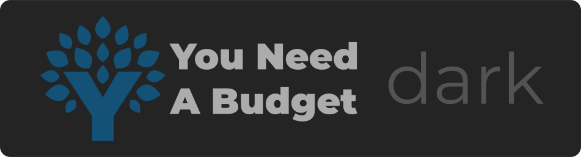

  
   
  
  
  
  

# YNAB Dark theme
This is a dark theme for [You Need A Budget (YNAB)](https://www.youneedabudget.com/)  [webapp](https://app.youneedabudget.com/). This custom userstyle follows [UserCSS](https://github.com/openstyles/stylus/wiki/UserCSS) guidelines.

### Easy install

## Table of Contents

1. [Preview](#preview)
2. [How to use](#how-to-use)
3. [Notes](#notes)
4. [Contributing](#contributing)

## Preview

### Screenshots

Coming soon.
<!--  -->

**[Back to top](#table-of-contents)**

## How to use

A userstyle extension for your browser is required, here are a few to choose from:

- [Stylus](https://github.com/openstyles/stylus) for [Firefox](https://addons.mozilla.org/en-US/firefox/addon/styl-us/), [Chrome](https://chrome.google.com/webstore/detail/stylus/clngdbkpkpeebahjckkjfobafhncgmne?hl=en), or [Opera](https://addons.opera.com/en-gb/extensions/details/stylus/).

<small>The Chrome extension also works for Edge.</small>

Install the dark theme with the link below. Supports automatic updates.

- [Install YNAB Dark](https://github.com/obscuredetour/ynab-dark/raw/master/ynab-dark.user.css)

Then, the raw file will open in the browser and the extension will open a new tab asking to install it. After clicking *'install style'*, you're finished.

Copy and pasting the [ynab-dark.user.css](https://github.com/obscuredetour/ynab-dark/raw/master/css/ynab-dark.user.css) file into the extension also works.

Further instructions can be found [here](https://github.com/openstyles/stylus/wiki/UserCSS#usercss-file).

**[Back to top](#table-of-contents)**

## Notes

#### How? 0.0.2 -> 1.0.0?
Preliminarly repository setup and initial color selection occured prior to finding YNAB's offical dark theme colors. This dark theme was found in their current CSS files being served to YNAB customers (2020/05). This made the project a lot easier. See below for more info.

#### Official YNAB Dark theme
For reference, included is YNAB's offical [dark theme snippet](css/ynab-dark-official.css) found in their website's CSS. This can be found in this project's `/css` directory and also linked above. This became the project's foundation that it was built upon.

#### Why hasn't YNAB released this if it exists?
Good question, don't know. Best guess, is that it isn't quite done. Found within their dark theme are some items that are  a bit off and/or oddly colored.

### Colors
Quite a bit of their colors are modified, but not too overtly or drastically. Mostly just toned down while introducing more grays and less stark whites.

**[Back to top](#table-of-contents)**

## Contributing

Open an issue first to discuss potential changes/additions.

**[Back to top](#table-of-contents)**
